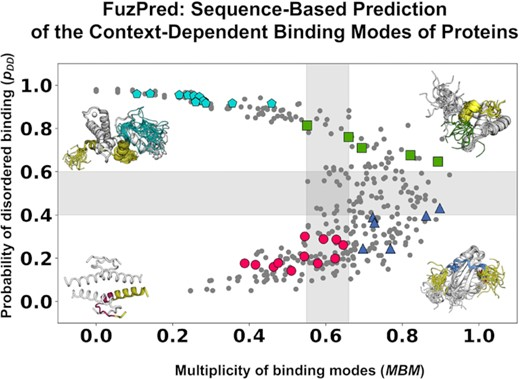

## Published the new FuzPred server!
*30th March 2023*

Paper published! :eyes: **FuzPred: a web server for the sequence-based prediction of the context-dependent binding modes of proteins**. :point_right: 
The server implements the algorithm initially developed by Monika Fuxreiter. Now, leveraging previous experience, the server and paper are organized to enhance the communication between our method and users and readers. I am joyful about the figures we designed; they are clear, very colorful, and present the data innovatively. I look forward to hearing from you and for you to use our server.  
Cheers!
{: .text-justify}

{: .text-justify}

## IDPConformerGenerator published!

IDPConformerGenerator is a flexible software suite for sampling the
conformational space of disordered proteins and regions, which must be described
as structural ensembles. IDPConformerGenerator samples backbone phi (φ), psi
(ψ), and omega (ω) torsion angles of relevant sequence fragments from loops and
secondary structure elements extracted from folded protein structures in the
RCSB Protein Data Bank and builds side chains from robust Monte Carlo algorithms
using expanded rotamer libraries, and more! Checkout the publication and GitHub
reposities :point_right:

{: .text-justify}

{: .text-justify}
