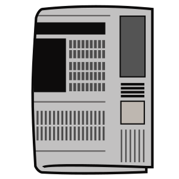

## IDPConformerGenerator published!

IDPConformerGenerator is a flexible software suite for sampling the
conformational space of disordered proteins and regions, which must be described
as structural ensembles. IDPConformerGenerator samples backbone phi (φ), psi
(ψ), and omega (ω) torsion angles of relevant sequence fragments from loops and
secondary structure elements extracted from folded protein structures in the
RCSB Protein Data Bank and builds side chains from robust Monte Carlo algorithms
using expanded rotamer libraries, and more! Checkout the publication and GitHub
reposities :point_right:

{: .text-justify}

