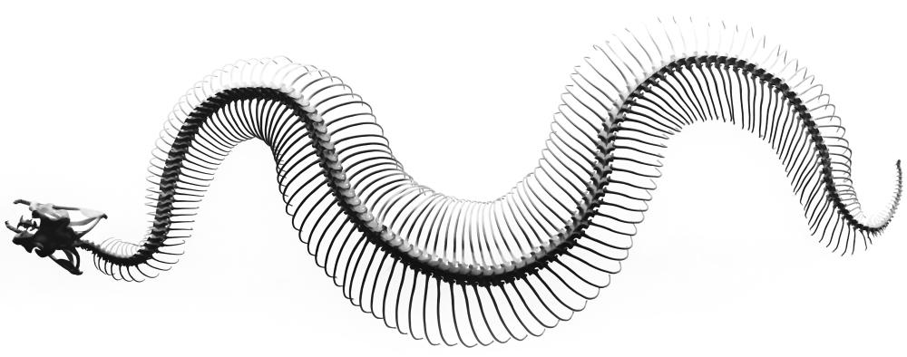

The software packages I have authored address pertinent needs of the structural
biology research field and leverage my ten-year background in studying protein
structure and dynamics experimentally. My software mainly focuses on modeling
intrinsically disordered proteins, designing the architecture for modular
docking software, handling protein structure data, assembling data analysis
pipelines, and establishing code-developing best practices. Projects are listed
below.
{: .text-justify}

## Opinion and technical articles

I enjoy writing about coding solutions to advanced problems I face at work. My
article [“Rethinking Python Decorators"](https://dev.to/joaomcteixeira/rethinking-python-decorators-2g53) on how to rewrite decorators to apply
them in multiprocessing and pickling exemplifies my approach toward programming
and advanced problem-solving. My articles on design choices and implementation
strategies in Python are on [DEV.to][devto].
{: .text-justify}

## Talks on software development

1. "From modeling multidomain proteins with HADDOCK2 to building HADDOCK3."  
   20 Years of HADDOCK, Huizen, The Netherlands, 7-10th November, **2023**  
   [Twitter](https://twitter.com/joaomcteixeira/status/1723830437376623028) |
   [Linkedin](https://www.linkedin.com/posts/joaomcteixeira_over-the-last-days-we-have-been-celebrating-activity-7129782080850247680-O4HJ/) |
   [Slides](https://bit.ly/20YRSHDK)  

1. "Modular code for a modular software: developing HADDOCK3".  
  [Instruct][instruct] Software Developers Exchange Webinar 5, June 10th, **2022**, *invited*.  
  [Website](https://instruct-eric.eu/content/instruct-software-developers-exchange-webinar-series) |
  [Twitter](https://twitter.com/joaomcteixeira/status/1529025387224768512) |
  [LinkedIn](https://www.linkedin.com/posts/joaomcteixeira_software-developer-exchange-5-modular-activity-6942532657725513728-hi9h/?utm_source=linkedin_share&utm_medium=member_desktop_web) |
  [Youtube](https://www.youtube.com/watch?v=5Uk1EvzCOIg) |
  [Slides](https://docs.google.com/presentation/d/1vW8CtNTLh0UDBjxsfz5f_Td8v-IEX6xY5SExv3SgpPk)  

1. "Introducing HADDOCK3: Enabling modular integrative modelling pipelines"  
  [BioExcel][bioexcel] Webminar, June 7th, **2022**, *invited*  
  [Website](https://bioexcel.eu/webinar-introducing-haddock3-enabling-modular-integrative-modelling-pipelines-2022-05-24/) |
  [Twitter](https://twitter.com/joaomcteixeira/status/1531942717726593025) |
  [LinkedIn](https://www.linkedin.com/posts/joaomcteixeira_bioexcel-webinar-67-introducing-haddock3-activity-6942780130758959104-Losw?utm_source=linkedin_share&utm_medium=member_desktop_web) |
  [Youtube](https://www.youtube.com/watch?v=V7uwFbVDKFE) |
  [Slides](https://docs.google.com/presentation/d/1C8KngBXWAF-6FJkP7DH-j6E1LKwYzqtwS2SSS_g-riM)  

1. "Introducing HADDOCK3, Enabling modular integrative modelling pipelines"  
   NMR Meeting at Utrecht University, 1st June, **2022**  
   [Slides](https://docs.google.com/presentation/d/1HLmxHFCR4vhDPYpdVbCrpdEOkEqPw3l_5VK1yTSALcA)

1. "Effective open-science practices for organizing a scientific software repository - extended"  
  International Symposium on Grids & Clouds (ISGC), 20-25th March, **2022**, Virtual Conference.  
  [Abstract](https://docs.google.com/document/d/1dZ4XsI7UahdoSINcNuOiH8T_bZtaHDUMDc1-4qcFDQk) |
  [Slides](https://docs.google.com/presentation/d/1phdI7Q0aiK1dwh7TAcvNqlGVObWLq__WuZ-TUD5XRfM)  

1. "Effective open-science practices for organizing a scientific software repository - short"  
  OSCU Open Science Symposium - Faculty of Science, October 10th, **2021**, Utrecht University, Netherlands.  
  [Slides on OSF](https://osf.io/ghfbr/) |
  [Slides on GDrive](https://docs.google.com/presentation/d/1rD5H7Eps5LHKQAhu21KFywDxbKawOalfXWVDYVVTL0U)  

## Scientific Software

### Python project skeleton

Python-project-skeleton is a template repository where I explain how to
configure a python package using the latest best practices in open-source
software. PPS has an efficient package structure, documentation, tests, and
continuous integration actions covering all needs for automatic deployment.
Others can use PPS as a template for their projects or navigate around it for
educational purposes because I thoroughly document all strategies I adopted.

{: .text-justify}

{: .align-center}

### IDPConformerGenerator

IDPConformerGenerator is a flexible, highly competitive, and modular open-source
software platform for sampling the conformational space of Intrinsically
Disordered Proteins. From an input aminoacid sequence, IDPCG can generate large
and diverse ensembles of all-atom disordered protein states that obey geometric,
steric, and other physical restraints. It also models loops and terminal tails
with post-transcriptional modifications and accounts for bound protein partners
and lipid bilayers!

{: .text-justify}

{: .align-center}

### HADDOCK3

*"HADDOCK3 is the next generation integrative modelling software in the
long-lasting HADDOCK project. It represents a complete rethinking and rewriting
of the HADDOCK2.X series, implementing a new way to interact with HADDOCK and
offering new features to users who can now define custom workflows
... [read more](https://www.bonvinlab.org/haddock3/intro.html)"*

{: .text-justify}

{: .align-center}

### pdb-tools

`pdb-tools` is *a swiss army knife for manipulating and editing PDB files*. It
is an ecosystem of more than 40 commands users can chain freely to allow maximum
versatility. `pdb-tools` is written entirely in Python standard library,
requiring no dependencies.

{: .text-justify}

{: .align-center}

### SPyCi-PDB

SPyCi-PDB is a user-friendly Python interface to back-calculate experimental
data for singular or ensembles of PDB structures. SPyCi-PDB can calculate NMR
chemical shifts, NOE, J-couplings, PRE, RDCs, SAXS, and hydrodynamic radius.

{: .text-justify}

{: .align-center}

### taurenmd

*taurenmd* is a command-line ecosystem to analyze and manipulate Molecular
Dynamics trajectories. I wrote *taurenmd* to have a centralized platform with a
common API that leverages the potential of several software, such as MDAnalysis
and MDtraj. *taurenmd* also serves as a hub to implement standardized protocols
for MD analysis. *taurenmd* can be used as a python library but is was designed
to work mainly as command-lines.

{: .text-justify}

{: .align-center}

### FarSeer-NMR

*FarSeer-NMR* is a software suite for automatic treatment, analysis and plotting
of large and multi-variable data sets of NMR peaklists of proteins. Users can
provide peaklists from complex titration schemes, for example, the same protein
against multiple ligands, a temperature range, **and** a pH range, and
*FarSeer-NMR* will calculate the spectral changes for every combination of
conditions.

{: .text-justify}

{: .align-center}

### mdacli

`mdacli` is a command-line interface for MDAnalysis. The aim is to provide
access to all MDAnalysis' operations via command-lines. Command lines are
created automatically from MDAnalysis analysis classes, avoiding the need to
manually update the codebase for new functionalities in the main MDAnalysis
project.

{: .text-justify}

{: .align-center}

[pts]: https://pythonicthoughtssnippets.github.io/ "Pythonic Thoughts Snippets"
[devto]: https://dev.to/joaomcteixeira "DEV.to JMCT"
[instruct]: https://instruct-eric.eu/ "INSTRUCT-ERIC"
[bioexcel]: https://bioexcel.eu/ "BioExcel"
