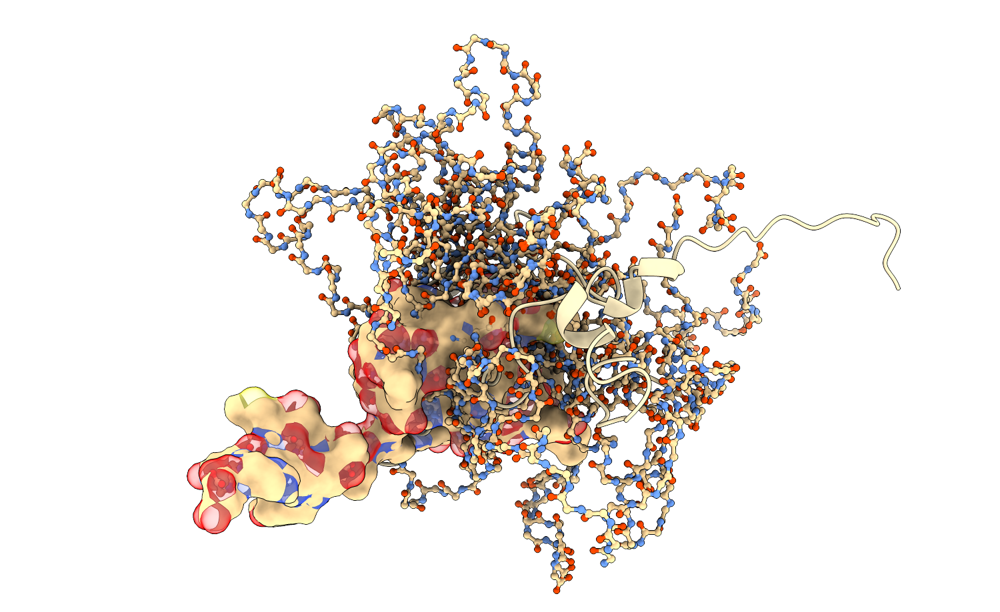

---
# You don't need to edit this file, it's empty on purpose.
# Edit theme's home layout instead if you wanna make some changes
# See: https://jekyllrb.com/docs/themes/#overriding-theme-defaults
layout: single
author_profile: true
---

I am a computational structural biologist with a Ph.D. in Biophysics (2014),
developing new methods to model protein dynamics of multidomain and
intrinsically disordered proteins in health and disease. I have vast
experience in software engineering and high-performance numerical computations
in Python, C.I. implementation, and best practices for scientific software
distribution. Additionally, I have a ten-year background in experimental
research of protein dynamics, granting me a deep understanding of the domain
knowledge covering the methods I am developing. I look forward to discussing
future projects with you; contact me!
{: .text-justify}

