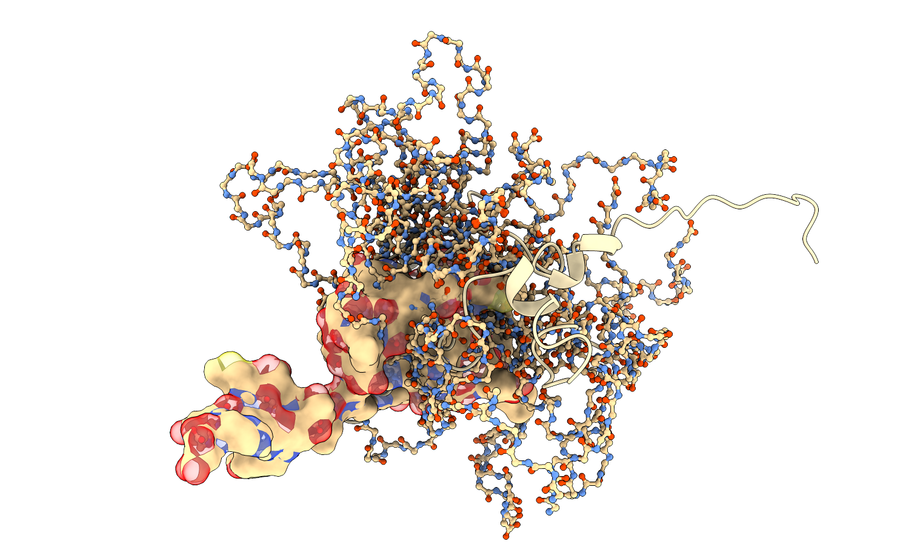

---
# You don't need to edit this file, it's empty on purpose.
# Edit theme's home layout instead if you wanna make some changes
# See: https://jekyllrb.com/docs/themes/#overriding-theme-defaults
layout: single
author_profile: true
---

**Current:** Senior Research Software Engineer at [Zymvol Biomodeling](https://zymvol.com/).

* **Scientific Workflows:** Leading the development of Zymvol’s core research software suites, ensuring they meet the stringent reliability standards of a production-grade scientific environment.

* **Cloud Architecture & FinOps:** Architecting and scaling scientific workflows to run seamlessly across HPC clusters and Google Cloud. Deeply integrating FinOps strategies to optimize cloud infrastructure, ensuring maximum cost efficiency and resource utilization without compromising computational power.

* **DevOps Vision & Engineering Excellence:** Guiding the overarching DevOps strategy. Fostering Test-Driven Development (TDD), clean code principles, and robust CI/CD pipelines to ensure the continuous delivery of highly stable, deployable software for multidisciplinary research teams.

* **Technical Leadership & Mentorship:** Directing strategic technical decision-making while promoting a blameless, growth-oriented team culture.

### Background

Specialized in computational structural biology, holding a Licentiate in Biochemistry (2008) and a Ph.D. in Biophysics (2014). My research focused on the structural dynamics of multidomain and intrinsically disordered proteins in solution using NMR spectroscopy. I bridged the gap between methodologies by coupling wet-lab execution (recombinant protein expression and high-purity purification) with advanced computational modeling. From 2015 to 2024, while in academia, I expanded my expertise into software engineering in Python, delivering critical open-source suites including the NIH-funded IDPConformerGenerator and the BioExcel-funded HADDOCK3. Parallel to my technical work, I served as a scientific advisor across numerous collaborations on protein structure and dynamics, while consistently mentoring and empowering students to thrive in their careers. I have authored +30 scientific publications and one book chapter.

